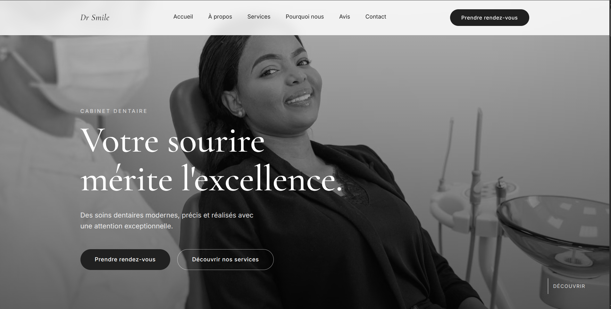

# Dr Smile — Premium Dental Clinic

A premium dental clinic website. Built with HTML, CSS and JavaScript, featuring GSAP animations, scroll-triggered reveals, a minimalist elegant interface and a fully responsive navigation.

---

## Features

- **Cinematic intro** : preloader and hero entrance timeline with line-by-line title reveal
- **GSAP animations** : parallax zoom on the hero image and orchestrated entrance effects
- **ScrollTrigger** : scroll-based reveals across all sections (about, services, why us, gallery, testimonials, process)
- **Animated counters** : key statistics that increment on scroll
- **Auto-sliding testimonials** : smooth GSAP-powered carousel, pauses on hover
- **Animated process timeline** : connecting line that fills progressively on scroll
- **Mobile menu** : responsive navigation with animated burger menu and integrated booking button
- **Interactive form** : floating labels and focus animations
- **Fully responsive** : breakpoints for tablet and mobile

---

## Technologies Used

- **HTML5** – Semantic and accessible structure
- **CSS3** – Custom properties, Grid, Flexbox, media queries
- **JavaScript (Vanilla)** – Interactions, animations, counters, mobile menu, slider
- **GSAP 3.12 + ScrollTrigger** – Timeline sequencing and scroll-based animations
- **Google Fonts** – Cormorant Garamond (titles), Inter (body)

---

## Preview

